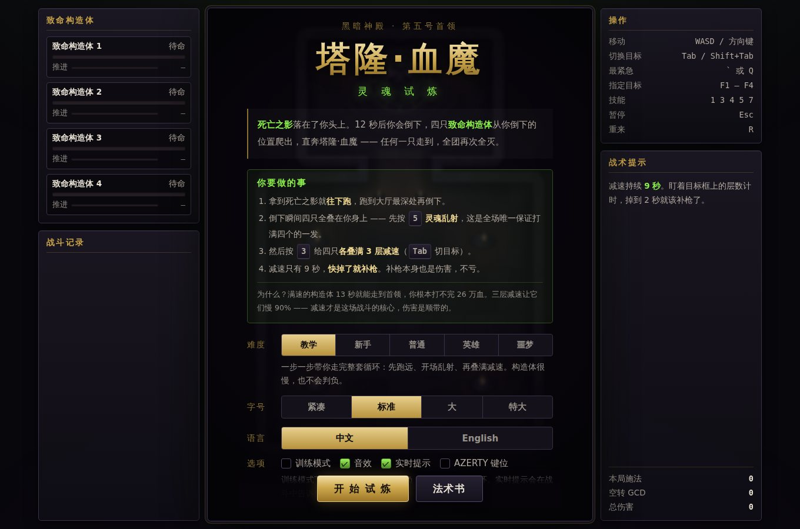
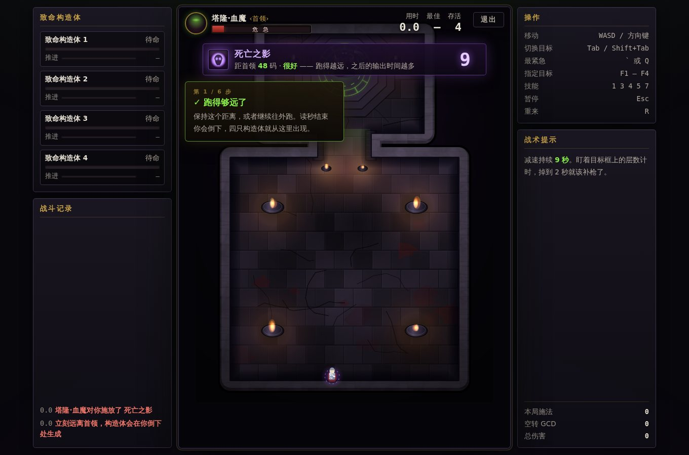
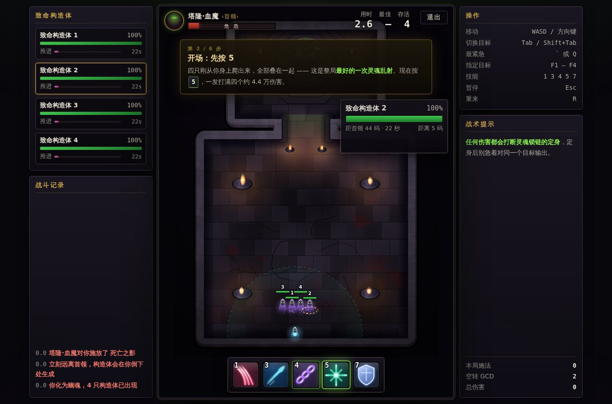
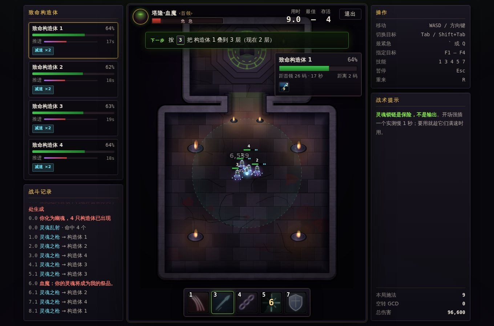
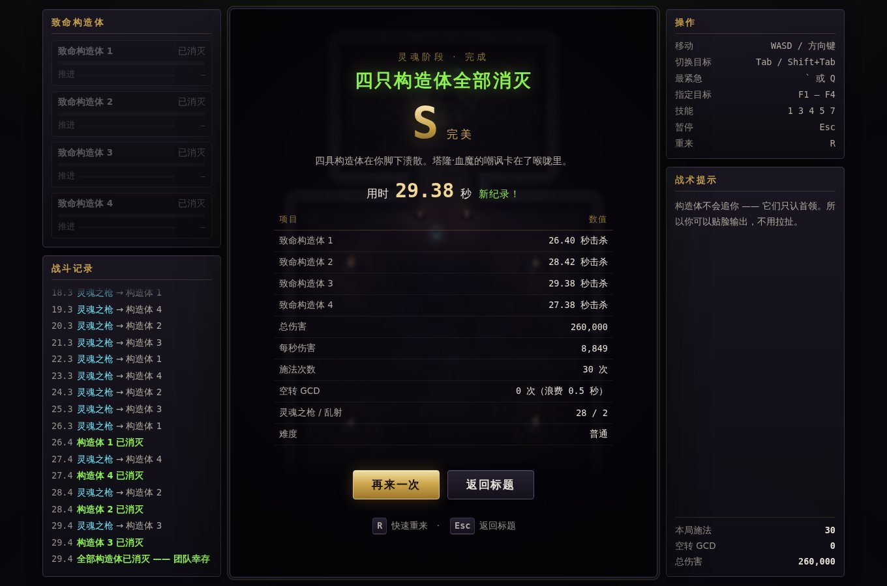
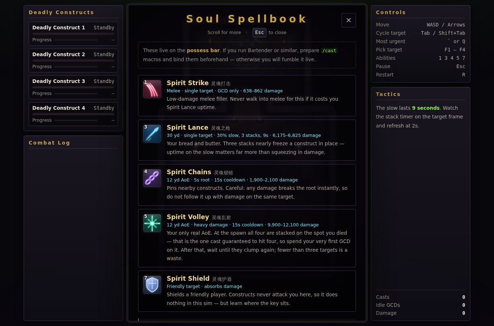

# 塔隆·血魔 · 灵魂试炼

魔兽世界 TBC《黑暗神殿》第五号首领 **塔隆·血魔（Teron Gorefiend）** 的
**死亡之影 / 灵魂阶段** 训练模拟器，中文 / English 双语。

> 拿到「死亡之影」的那一刻，全团的命就交到你手上了。
> 这个网页版模拟器让你在开荒之前，把那 60 秒的操作练到形成肌肉记忆。

**在线试玩** → <https://tomqwu.github.io/teron/>　·　界面支持 **中文 / English** 切换

---

## 长什么样

<table>
<tr>
<td width="50%"><br>
<sub><b>标题界面</b> —— 四步速览讲清楚你到底要做什么，五档难度第一档是带引导的教学</sub></td>
<td width="50%"><br>
<sub><b>死亡之影阶段</b> —— 地面箭头指路，读数实时告诉你离首领多远、够不够远</sub></td>
</tr>
<tr>
<td><br>
<sub><b>教学</b> —— 六步走完整套循环，每步高亮对应技能格</sub></td>
<td><br>
<sub><b>实时提示</b> —— 按紧急程度算出下一个该按的键；左栏是四只的血量、减速层数与抵达倒计时</sub></td>
</tr>
<tr>
<td><br>
<sub><b>结算</b> —— 每只的击杀时间、DPS、施法次数与空转 GCD</sub></td>
<td><br>
<sub><b>法术书（English）</b> —— 界面可随时切换中英，技能名双语对照</sub></td>
</tr>
</table>

---

## 这是什么

原版是 [teron.faldorn.net](https://teron.faldorn.net/terongame/) 上的英文小游戏。
本项目是一次**完整重写**：中文界面 + 全新程序化美术 + 大量玩法改进。

* **零依赖、零构建** —— 纯 HTML / CSS / JavaScript，没有 Phaser、没有打包器、没有 npm。
* **零外部素材** —— 场景、角色、法术图标全部由 Canvas 程序化生成；
  音效由 WebAudio 实时合成。游戏本体（HTML + CSS + JS）不到 200 KB，离线也能跑
  —— 仓库里唯一的图片是上面这几张 README 截图。
* **数值忠于原作** —— 构造体 65000 血、3.5 码/秒，灵魂之枪 6175–6825 且
  30% 减速可叠 3 层，灵魂锁链的定身会被任何伤害打断……都和游戏里一致。

## 完全没打过？先开「教学」档

标题界面的难度第一档是 **教学**：构造体只有 55% 速度、不会判负，
界面会一步一步告诉你现在该做什么 ——
**跑远 → 5 乱射 → 认识 4 锁链 → 每只上一枪 → 叠满三层 → 维持减速**。
六步走完，你就已经把整套循环打过一遍了。

打完教学后，战斗中还会常驻一行**实时提示**（可在选项里关掉），
按紧急程度告诉你下一个该按的键，并把对应的技能格高亮起来：

* 乱射好了且范围内有三只以上 → 提示放**灵魂乱射**（开场必定命中四个）
* 死亡位置太靠前 → 开场就提示用**灵魂锁链**把时间抢回来
* 有构造体快到首领了 → 提示用**灵魂锁链**钉住它
* 有人身上没减速 → 提示补**灵魂之枪**
* 减速还剩不到 2.5 秒 → 提示立刻补枪
* 减速都满了、乱射也好了、范围里有三只以上 → 提示放**灵魂乱射**

## 玩法

1. **死亡之影阶段（12 秒）** —— 你还活着。朝远离首领的方向狂奔，
   你跑出的每一码，都是倒下之后能争取到的输出时间。地面上的绿色箭头会给你指路。
2. **灵魂阶段** —— 你倒下，四只**致命构造体**从尸体中爬出，径直冲向塔隆·血魔。
   控制条亮起，你有五个技能。**在它们抵达之前全部消灭。**

### 技能（控制条位置与游戏内一致）

| 键位 | 技能 | 说明 |
|:---:|---|---|
| `1` | 灵魂打击 | 近战单体，伤害很低，填空档用 |
| `3` | 灵魂之枪 | 30 码单体主力，**减速 30%、可叠 3 层、持续 9 秒** |
| `4` | 灵魂锁链 | 12 码定身 5 秒，冷却 15 秒 —— **任何伤害都会打断** |
| `5` | 灵魂乱射 | 12 码群体高伤害，冷却 15 秒 |
| `7` | 灵魂护盾 | 给友方套盾，本模拟中无效果（但键位要记住） |

### 核心循环

**开场先按 `5`。** 四只是从你倒下的那一点爬出来的，出生瞬间全部重叠 ——
这是整局唯一能保证一发打满四个的**灵魂乱射**（约 4.4 万伤害）。

**然后是 `3`：**给四只各叠满三层灵魂之枪（减速 90%，它们几乎原地爬行），
之后靠补枪维持 + 乱射冷却好了就打。
**保住减速永远比多打一点伤害重要。**

**`4` 灵魂锁链是保险，不是输出。**用无头浏览器各跑三把对比过：
开场强行插一个锁链，通关时间稳定慢 **1 秒**（正好一个公共冷却），
因为它只有 2000 伤害。所以留着 —— 死得太靠前、或者有人快摸到首领时再用。
真要用就趁它们**满速**时用：满速 5 秒定身能拦下 17 码，
等减速叠满之后同样 5 秒只值 1.7 码。

| 开场 | 胜率 | 通关用时（噩梦档，各三次） | 平均 |
|---|:---:|---|:---:|
| 第一个公共冷却就放乱射 | 3/3 | 29.38 / 29.38 / 29.42 | **29.39** |
| 不强制，够三只再放乱射 | 3/3 | 29.43 / 29.40 / 29.42 | 29.42 |
| 乱射 → 锁链 → 叠枪 | 3/3 | 30.42 / 30.43 / 30.45 | 30.43 |

> 有人把技能类比成法师：`4` 锁链 ≈ **冰环**（定身），`5` 乱射 ≈ **奥爆**（群伤）。
> 别记反了 —— 记反了开场就会用错技能。

### 操作

| | |
|---|---|
| 移动 | `W` `A` `S` `D` / 方向键 / 点击、拖动地面 |
| 切换目标 | `Tab` · `Shift+Tab` · 直接点击构造体 |
| 最紧急目标 | `` ` `` 或 `Q` |
| 指定目标 | `F1` – `F4` |
| 暂停 / 重来 | `Esc` / `R` |

支持 AZERTY 键位（标题界面可切换）。手机端可触屏移动、点选目标、点技能图标。
局内右上角常驻**退出**按钮（等同 <kbd>Esc</kbd>），随时可以回到标题界面。

**语言**在标题界面可以随时切换中文 / English，首次打开会跟随浏览器语言，选择会记住。
界面文案、技能名、战斗记录、结算、教学步骤与实时提示全部双语。

**界面字号**在标题界面有四档（紧凑 / 标准 / 大 / 特大），整站字号、行距与
底部操作区高度都会跟着变，场地渲染范围也会重算，选择会记住。

## 相比原版的改动

**画面**

* 全新程序化渲染的黑暗神殿祭坛：错缝石板地面、火盆动态光照、
  邪能符文高台、裂缝与血迹、暗角与环境光。
* 塔隆·血魔本体：悬浮的死亡骑士剪影、旋转符文环、镰刀、邪能眼。
* 构造体是尖顶兜帽的破碎幽魂，减速时缠绕冰蓝光点，定身时套上冰棱外壳。
* 五个手绘风格法术图标，带倒角与发光。
* 所有音效 WebAudio 实时合成，含黑暗神殿低频环境音。

**玩法**

* **五档难度** —— 教学 / 新手 / 普通 / 英雄 / 噩梦，调整构造体速度、准备时间与生成分散度。
* **五步引导教学** —— 带着新玩家把完整循环走一遍，构造体减速且不会判负。
* **实时提示** —— 按紧急程度算出下一个该按的键，并高亮对应技能格。
* **训练模式** —— 构造体抵达首领不判负，而是被推回门口，可以无限练循环。
* **构造体面板** —— 每只的血量、减速层数、推进进度与**抵达首领倒计时**一目了然。
* **WoW 式冷却转圈** + 距离/可用性变色（灰=冷却，红=距离不够，绿框=大招好了）。
* **智能目标切换** —— 目标死亡后自动接管最紧急的那一只。
* **飘字伤害、战斗记录、施法提示、屏幕震动**。
* **成绩与评级** —— S/A/B/C 评级、按难度分别记录的个人最佳、
  结算面板列出每只的击杀时间、DPS、施法次数与**空转 GCD**。
* **12 码 AoE 参考圈**，实时告诉你灵魂乱射能盖住几个。
* **死亡之影阶段的距离读数与指引箭头**，直接教会新人"要跑远"。
* 移动端专用底部构造体条与放大的技能按钮。

**排版**

界面按中文字形的可读性重做过一遍：全站字号由 `--ui` 一个变量统管
（最小 11px，正文 13.5–15px，按钮 17px），次级灰字对比度提到 WCAG AA 以上，
战斗记录压缩成单行不折行，构造体名牌在聚堆时自动错层，
底部操作区高度实测后写回 CSS 变量 —— 所以换字号档位时 HUD 不会串位、
场地也会跟着缩放而不是被面板盖住。

## 本地运行

任意静态服务器即可（也可以直接双击 `index.html`）：

```bash
python3 -m http.server 8000
```

然后打开 <http://localhost:8000>。

## 部署到 GitHub Pages

仓库自带 `.github/workflows/pages.yml`。推送到 `main` 后，在
**Settings → Pages → Source** 选择 **GitHub Actions** 即可，无需任何构建配置。

## 目录结构

```
index.html          页面骨架 + DOM 抬头显示
css/style.css       黑暗神殿风格界面
js/util.js          工具函数
js/i18n.js          中英文文案与静态节点绑定
js/config.js        战斗数值、场地几何、难度、文本
js/art.js           程序化美术（场景烘焙、角色、图标）
js/audio.js         WebAudio 音效合成
js/fx.js            粒子、飘字、弹道、震动
js/entities.js      导航、玩家、构造体
js/coach.js         实时提示与教学步骤
js/ui.js            抬头显示与覆盖层
js/game.js          状态机、输入、更新、渲染
js/main.js          启动与主循环
```

## 致谢

* 玩法与数值来自 [Faldorn 的原版 Teron 小游戏](https://teron.faldorn.net/terongame/)。
* 《魔兽世界》与塔隆·血魔归 Blizzard Entertainment 所有。
  本项目为非商业粉丝作品，未使用任何暴雪的美术或音频素材 —— 画面与声音全部为程序化生成。
